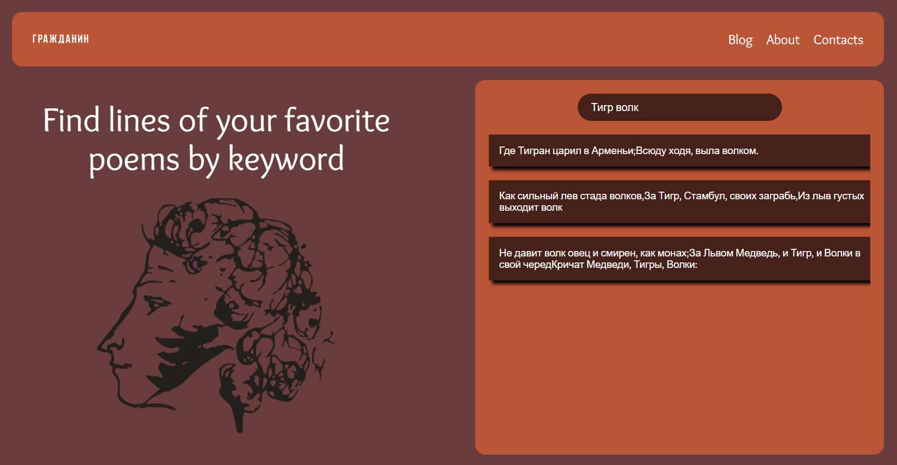

# Поиск стихов по ключевым словам.

## Вводятся ключевые слова (не больше 4), сайт ищет строчки стихов, где встречаются все введенные слова. Поиск идет с сервера https://buymebuyme.xyz, где представлены стихи в формате JSON.

## Используемые технологии:
* HTML, CSS, JavaScript
* BEM, Nested
* XMLHTTPRequest
* VS Code
## Планируемые доработки
* Адаптив
* Валидация ввода, показывать сообщение при отстутствии стихов
* Добавить прелоадер перед загрузкой стихов
* Очистка стихов по кнопке

[Демо](https://azmorigan.github.io/search-poems/)